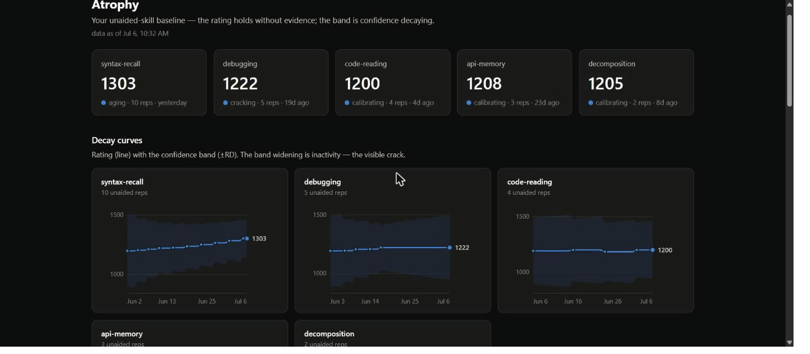

# Atrophy

**A decay curve for your unaided coding skill.**

[](https://github.com/ashutosh-rath02/atrophy/actions/workflows/ci.yml)
[](LICENSE)
[](package.json)

Atrophy is a local-first CLI that measures what AI assistance is doing to your
unaided programming ability. Short, scheduled drills (5–10 minutes, AI off)
produce a per-skill rating over time — a personal baseline, the way a fitness
app tracks resting heart rate. The dashboard shows two things most tools
can't: how your unaided skill trends when you stop exercising it, and how far
it has drifted from your AI-assisted performance.



## Why

Skill loss under AI assistance is measurable, fast, and invisible from the
inside:

- Endoscopists' unaided detection rates fell **28.4% → 22.4%** within months of
  routine AI assistance ([*Lancet Gastroenterology & Hepatology*, 2025](https://www.thelancet.com/journals/langas/article/PIIS2468-1253(25)00133-5/abstract))
- Students with unrestricted GPT-4 scored **17% worse** than peers once access
  was removed ([*PNAS*, 2025](https://www.pnas.org/doi/10.1073/pnas.2422633122))
- Experienced developers were **19% slower** with AI tools while believing they
  were ~20% faster ([METR RCT, 2025](https://arxiv.org/abs/2507.09089))
- AI-assisted engineers scored **17% lower** on comprehension of code they had
  just written, with debugging declining most ([Anthropic, 2026](https://www.anthropic.com/research/AI-assistance-coding-skills))

The common thread is the absence of an internal warning signal: you cannot
feel the decay. Advice such as "No-AI Days" addresses the problem with
willpower and no measurement. Atrophy is the measurement. Full citations and
a validity discussion are in [docs/research.md](docs/research.md).

## Installation

Requires Node.js ≥ 22 and Python 3 on `PATH` (for the Python exercises).

```sh
npm install -g atrophy
```

Or from source:

```sh
git clone https://github.com/ashutosh-rath02/atrophy.git
cd atrophy
npm install && npm run build
npm link
```

## Quick start

```sh
atrophy baseline    # first session: one drill per skill axis (~25 min)
atrophy drill       # one rep; picks your most-overdue axis
atrophy stats       # ratings, confidence, recency per axis
atrophy serve       # decay dashboard at http://127.0.0.1:4646
```

A drill opens an exercise in a scratch directory via `$EDITOR`, times you
against a soft limit, and grades your submission automatically. Once a month,
run `atrophy drill --ai-on` and take the drill *with* your AI tools — that
data feeds the divergence chart and never touches your unaided rating.

## Commands

| Command | Description |
|---|---|
| `atrophy baseline` | One drill per axis to establish your initial profile |
| `atrophy drill` | A single unaided micro-drill on the most-overdue axis |
| `atrophy drill --axis <axis>` | Drill a specific axis (`syntax-recall`, `debugging`, `code-reading`, `api-memory`, `decomposition`) |
| `atrophy drill --lang <language>` | Restrict to `python` or `javascript` |
| `atrophy drill --ai-on` | Comparison rep with AI tools allowed; recorded separately |
| `atrophy drill --solution <file>` | Non-interactive grading of a prepared file (scripting/CI) |
| `atrophy stats` | Per-axis rating ± confidence, rep count, tier, recency |
| `atrophy serve [--port <n>]` | Local dashboard server (loopback only) |
| `atrophy export [-o <file>]` | Full data export as JSON — the dashboard's exact payload |

## Skill axes

| Axis | Drill | Grading |
|---|---|---|
| Syntax recall | Write a function from a spec | Hidden test suite |
| Debugging | Fix a planted bug in working-looking code | Hidden test suite |
| Code reading | Predict a snippet's exact stdout | Compared against the snippet's real output |
| API memory | Fill the blank in a stdlib call | Normalized answer match |
| Decomposition | Outline a design under time pressure | Self-scored against a rubric |

Exercises ship in Python and JavaScript across three difficulty tiers. The
bank is validated by CI: every planted bug provably fails at least one test,
and every prediction snippet provably runs deterministically.

## Scoring model

- **Per exercise** — `score = correctness × time factor`. Correctness is the
  fraction of hidden tests passed. The time factor is 1.0 up to the soft
  limit, then decays exponentially with a floor, so a slow correct answer
  always outscores a fast wrong one.
- **Per axis** — an Elo-style rating (K = 32 for the first 10 reps, then 16)
  updated against the exercise's difficulty tier, making scores comparable
  across exercises.
- **Decay** — a Glicko-style rating deviation (RD) widens with inactivity,
  reaching its maximum after roughly 60 idle days. The rating itself never
  drops without evidence; what decays is the *confidence* in it. The dashboard
  renders this as a confidence band that visibly widens while you coast.
- **Difficulty** — two consecutive strong passes promote you a tier; two
  consecutive fails demote.

## Data & privacy

All data lives in a single SQLite file you own (`~/.atrophy/atrophy.db`,
override with `ATROPHY_DB`). No account, no sync, no telemetry, no network
access at drill time. The dashboard server binds to `127.0.0.1` and reads the
same file.

## Limitations

- Micro-drills are a **proxy** for real-world skill, not a clinical
  instrument, and this project makes no clinical claims.
- Practice effects are real: drilling improves drill scores. That is the
  intended maintenance effect, but it means absolute ratings matter less than
  trends and the unaided-vs-assisted gap.
- "AI off" is an honor system in v1. The drill directory contains an
  `AI-OFF.lock` file stating the pledge; assistant process detection is
  planned, and it will warn rather than block.

## Development

```sh
npm run dev -- drill   # run the CLI from source
npm run typecheck
npm test               # 70 tests, incl. real Python/Node grading subprocesses
npm run build
```

```
cli/         commander CLI and the dashboard server
engine/      subprocess runner, grading harnesses, scoring, drill sessions, timelines
bank/        exercise JSON, zod schema, loader, bank-integrity tests
store/       SQLite persistence (better-sqlite3)
dashboard/   single-file dashboard (no build step, no external dependencies)
docs/        research citations and assets
```

Contributions are welcome — new exercises especially. An exercise is a single
JSON file under `bank/exercises/<axis>/`; the schema is enforced by
`bank/schema.ts` and the integrity suite will reject unsolvable or
non-deterministic submissions.

## Roadmap

- VS Code extension and assistant-process detection
- LLM-judged decomposition drills
- More languages and a larger exercise bank
- Spaced-repetition scheduling (FSRS)

## License

[MIT](LICENSE) © 2026 Ashutosh Rath
